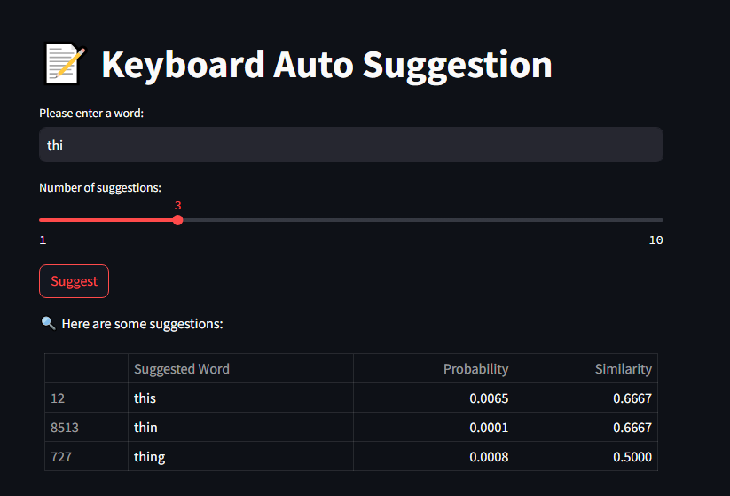

# Keyboard Auto Suggestion App
This Streamlit web app provides real-time word suggestions and autocorrection based on a preloaded text corpus. Users can input a word, and the app will suggest the most similar words along with their probability and similarity scores displayed as percentages. The app supports customizable suggestions, allowing users to select the number of suggestions they want to see. 

